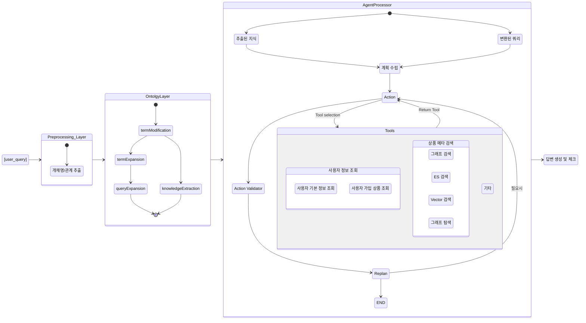

# map-search-agent
map-search-agent repository in "데이터 모델링팀"

## 환경 설정 가이드

### Neo4j 연결 설정
Neo4j 연결 URL은 실행 환경에 따라 다르게 설정해야 합니다:
- LangGraph 환경: `url="bolt://localhost:7687"`
- OpenWebUI 환경: `url="bolt://neo4j-gds-apoc-n10s:7687"`

### Local 개발 환경 설정

1. **LangGraph 서버 실행**
   ```bash
   langgraph serve
   ```

2. **Neo4j 컨테이너 실행**
   ```bash
   docker compose up -d
   ```

### 주의사항
- LangGraph 환경에서는 Neo4j 연결 URL을 `bolt://localhost:7687`로 설정합니다.
- OpenWebUI 환경에서는 `bolt://neo4j-gds-apoc-n10s:7687`를 사용합니다.
- Neo4j 기본 접속 정보:
  - Username: neo4j
  - Password: neo4jpassword
  - Port: 7687

## 시스템 아키텍처 다이어그램

