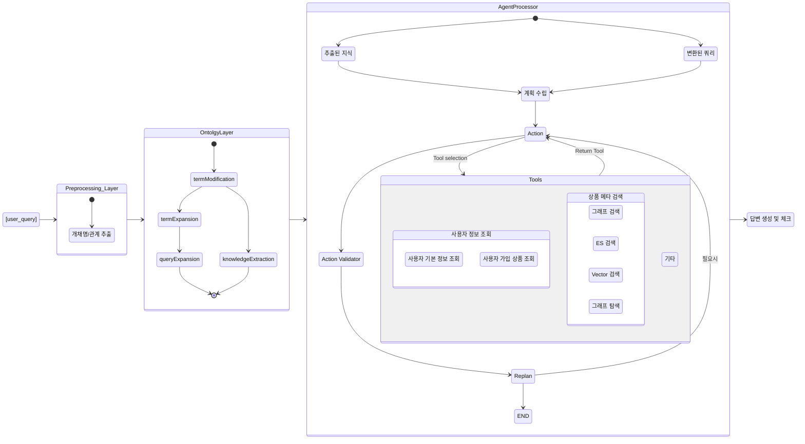

# map-search-agent
map-search-agent repository in "데이터 모델링팀"

## 환경 설정 가이드

### Neo4j 연결 설정
Neo4j 연결 URL은 실행 환경에 따라 다르게 설정해야 합니다:
- LangGraph 환경: `url="bolt://localhost:7687"`
- OpenWebUI 환경: `url="bolt://neo4j-gds-apoc-n10s:7687"`

### Local 개발 환경 설정

1. **전체 서비스 시작**
   ```bash
   cd docker
   docker compose up -d
   ```

2. **개별 서비스 시작 (선택적)**
   ```bash
   docker compose up -d neo4j pgvector backendapi openwebui
   ```

3. **LangGraph 개발 서버 (로컬 테스트용)**
   ```bash
   langgraph serve
   ```

### 서비스 접속 정보
- **Neo4j Browser**: http://localhost:7474 (neo4j/neo4jpassword)
- **pgvector**: localhost:5432 (pguser/postgrespassword)  
- **Backend API**: http://localhost:8000
- **OpenWebUI**: http://localhost:3000
- **Jupyter**: http://localhost:8888 (token: mytoken)

### pgvector 권한 문제 해결

새로 설치하는 경우 초기화 스크립트가 자동으로 권한을 설정합니다.

기존 설치에서 권한 오류가 발생하는 경우:
```bash
# postgres 관리자로 접속
docker exec -it pgvector-container psql -U postgres -d vectordb

# 권한 부여 실행
GRANT SELECT, INSERT, UPDATE, DELETE ON TABLE few_shot_examples TO pguser;
GRANT USAGE, SELECT ON SEQUENCE few_shot_examples_id_seq TO pguser;
```

### 연결 테스트
```bash
# Backend API 상태 확인
curl http://localhost:8000/v1/models

# pgvector 연결 확인  
docker exec -it pgvector-container psql -U pguser -d vectordb -c "SELECT COUNT(*) FROM few_shot_examples;"
```

### 주의사항
- LangGraph 환경에서는 Neo4j 연결 URL을 `bolt://localhost:7687`로 설정합니다.
- OpenWebUI 환경에서는 `bolt://neo4j-gds-apoc-n10s:7687`를 사용합니다.
- Neo4j 기본 접속 정보:
  - Username: neo4j
  - Password: neo4jpassword
  - Port: 7687

## 시스템 아키텍처 다이어그램

